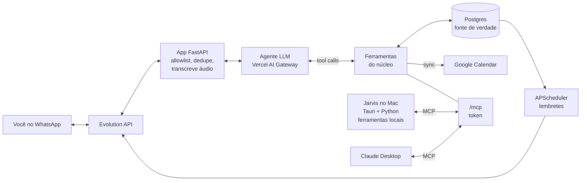

# Gerenciador de Vida — Visão e decisões

Versão de 08/10/2026. Este arquivo guarda o **porquê**: visão, decisões, riscos e o que está em aberto. O **o quê** (requisitos e cenários de cada parte) está em `openspec/specs/<capacidade>/spec.md`. Mudanças novas entram como *changes* do OpenSpec (`openspec/changes/`). As fases 1 a 7, anteriores ao OpenSpec, estão registradas em `docs/fases/`.

## Visão e escopo

Um assistente pessoal de usuário único (Kaio) com duas portas para o mesmo núcleo: **WhatsApp**, para lançamentos, consultas e lembretes, e o **Jarvis no Mac**, com design próprio, texto e voz. O núcleo **lê e escreve** num banco próprio por linguagem natural: o LLM escolhe a ferramenta, e as regras moram no código. Texto, áudio e foto de recibo são aceitos como entrada. O núcleo também expõe as ferramentas por MCP.

**Exemplos que o sistema resolve:**

| Mensagem | O que o sistema faz |
| --- | --- |
| "coloque na agenda o aniversário da minha irmã, 14 de março" | Cria evento anual no banco e no Google Calendar; confirma |
| "que dia é minha prova de direito administrativo?" | Busca em eventos e responde com data e hora |
| "gastei 47 no almoço no Nubank" | Lança a despesa (valor, categoria, cartão, hoje) e devolve o resumo |
| (foto de um cupom fiscal ou print de Pix) | Extrai estabelecimento, valor e data; pede confirmação antes de gravar |
| (áudio) "paguei 120 de gasolina no pix" | Transcreve, mostra o que entendeu, pede confirmação |
| "total da fatura do Nubank de novembro" | Soma em SQL os lançamentos daquele ciclo de fatura |
| "quanto gastei com mercado esse mês?" | Agregação por categoria e período |

**Dentro:** agenda (eventos, recorrências, prazos, pessoas), gastos (lançamento, recibo, consultas e totais por fatura, categoria e período), lembretes proativos, MCP, Jarvis.

**Fora (por ora):** importação automática de fatura, Open Finance, painel web, múltiplos usuários, metas e orçamento.

## Mapa das capacidades (`openspec/specs`)

| Capacidade | Cobre |
| --- | --- |
| `canal-whatsapp` | Evolution API, webhook, allowlist, idempotência, envio só ao dono, modo provisório |
| `agente` | modelos, classificador, grupos de ferramentas, validação e escalada, prompt, `agent_runs`, prova |
| `gastos` | lançar, confirmar, resolver meio, desfazer, cartões, consultas em SQL |
| `fatura` | regra da fatura, último dia do mês, parcelas, fatura aberta |
| `agenda` | eventos, pessoas, busca com recorrência, atualizar e remover, Google Calendar |
| `midia` | áudio (`faster-whisper` local), foto de recibo, origem herdada, mídia não guardada |
| `lembretes` | resumo do dia, lembrete de evento, fechamento de fatura, uma vez só |
| `mcp` | ferramentas do núcleo por MCP, `contexto`, `painel`, acesso restrito |
| `operacao` | hospedagem, segredos, backup cifrado, alerta de queda, dead man's switch |
| `jarvis-agente` | cérebro do Jarvis: núcleo só pelo MCP, ferramentas combinadas, canal local seguro |
| `jarvis-interface` | HUD, atalhos, estados, cartões, confirmação na interface |
| `ferramentas-locais` | ações no Mac sem shell (apps, Spotify, timer, arquivos, área de transferência) |
| `jarvis-voz` | push-to-talk, transcrição local, fala em streaming (Fish com reserva local), interrupção |
| `jarvis-painel` | painel em tela cheia: agenda, gastos, faturas, registro e conversa, dados prontos do núcleo |

## Decisões e riscos

| Decisão | Escolha | Risco principal | Mitigação |
| --- | --- | --- | --- |
| Canal WhatsApp | Evolution API v2 (Baileys, não oficial), self-hosted | Banimento do número; quebra quando o WhatsApp Web muda | Chip dedicado (ainda não em uso: ver modo provisório); volume baixo; camada `channel/` isolada |
| Agenda | Tabela própria é a fonte de verdade, espelhada no Google Calendar principal | Divergência entre banco e Calendar | Sync unidirecional banco → Calendar; `gcal_event_id`; edições sempre pelas ferramentas |
| Linguagem | Python 3.12 (FastAPI + cliente `openai` com o Vercel AI Gateway) | — | — |
| Entrada de gastos | Texto, áudio e foto de recibo; sem importação de fatura | "Total da fatura" só é exato se tudo for lançado | Cartão com dia de fechamento; conferência contra o app do banco |
| Hospedagem do núcleo | Oracle Cloud pay-as-you-go, São Paulo, dentro da cota grátis (desde 15/06/2026: 2 OCPU / 12 GB); Hetzner como plano B. **Provisório (08/10/2026): roda no Mac** (Oracle sem capacidade ARM); change `deploy-vps` pausado | Mac fechado = bot e lembretes parados | Backup cifrado; scripts de deploy prontos; atrasos de lembrete recuperados por até 6 h |
| Integração entre canais | Ferramentas do núcleo por MCP; Tailscale quando houver VPS | Duas lógicas divergindo | Regras só no núcleo; o Jarvis não toca o banco |
| Jarvis | Tauri 2 + React/Vite/TS (interface) e Python (agente, cliente MCP, ferramentas locais) no MacBook Air M5. Voz (09/10/2026): microfone capturado pelo app, push-to-talk ⌘⇧Espaço, transcrição local (`mlx-whisper` q4, presa na RAM), fala frase a frase pela Fish Audio (voz "Jarvis" da comunidade, modelo gratuito), tocada enquanto chega, com a voz do macOS de reserva; persona de mordomo ("senhor"). Painel em tela cheia com ⌥⇧Espaço, com dados prontos do núcleo e sem tokens | Latência da voz (aceite de 09/10/2026: simples 3,4–4,4 s; com ferramenta, resposta em 4,9–5,4 s; o 1º token do modelo domina); texto das respostas sai para a Fish; a voz imita uma pessoa real (uso privado, escolha do Kaio); permissões do macOS | Push-to-talk antes de wake word; streaming; "Um instante, senhor." em < 3 s; voz local se a Fish falhar; ID da voz e chave só no `.env` |
| Modelo de IA | Desde 08/10/2026: **Claude direto pela API da Anthropic** (SDK oficial, `LLM_PROVIDER=anthropic`): `claude-haiku-5-5` no classificador e no principal (US$ 0,10/0,50 por milhão de tokens; ~1,5 s por chamada), `claude-sonnet-5-5` na escalada. Prova: 56/56 no classificador e 55/56 (98%) no agente. O Vercel AI Gateway continua como alternativa (`LLM_PROVIDER=gateway`) | Modelo lançado em 07/10/2026, sem histórico de uso; chave colada na conversa | Prova a cada mudança; gateway como plano B; rotacionar a chave |
| Política de gravação | Grava direto com "desfazer"; confirma foto, áudio, exclusões e valores acima de R$ 500 | Gasto errado gravado sem perceber | Eco do que foi gravado em toda resposta |

**Modo provisório "conversa comigo mesmo" (`SELF_CHAT_MODE`, 07/10/2026).**
- Sem o chip dedicado, a instância está conectada ao número pessoal do dono, que fala com o bot na conversa consigo mesmo.
- Riscos aceitos: o número pessoal fica exposto a banimento, e os avisos não fazem o celular tocar.
- Ao trocar para o chip: `SELF_CHAT_MODE=false` e escanear o QR de novo.

**Por que isolar o canal.** A Evolution API suporta Baileys e a Cloud API oficial (`WHATSAPP-BUSINESS`) com o mesmo formato de webhook. Se o número for banido, troca-se a integração sem reescrever o agente.

**Contexto regulatório (out/2026).**
- Desde 15/01/2026, a Meta proíbe assistentes de IA de uso geral na API oficial.
- No Brasil, uma liminar do Cade suspende a proibição, e a Meta cobra "AI Providers" por mensagem a números +55 desde 11/03/2026.
- Um bot pessoal provavelmente não se enquadra, mas é zona cinzenta. Só pesa se migrar para a API oficial.

**Conta Claude compartilhada com o trabalho (08/10/2026).** O conector MCP está só no Claude Desktop do Mac, desligado por padrão nas conversas. O histórico de conversas é da conta, então dados pessoais usados ali ficam visíveis a quem compartilha a conta. O Claude Code não usa o MCP.

## Arquitetura

## Riscos e questões em aberto

O risco que mais derruba projetos assim é parar de lançar os gastos, não um defeito técnico. O atrito de entrada deve ser mínimo, e a fatura precisa ser conferível.

**Riscos**

- Banimento do número: perde-se o canal, não os dados. No modo provisório, o banido seria o número pessoal.
- Interpretação errada de valor ou data: eco do que foi gravado + "desfazer".
- Fatura divergente do banco: estornos, IOF e anuidade não entram sozinhos; considerar a ferramenta `ajuste_fatura`.
- Custo de LLM: orçamento mensal no painel do Vercel AI Gateway.

**Questões em aberto**

- [x] **Modelo rápido**: Claude Haiku 5.5 direto pela API da Anthropic (08/10/2026); escalada com Claude Sonnet 5.5. Desbloqueia a voz.
- [ ] Hospedagem: Oracle (tentativas) ou Hetzner. Change `deploy-vps`.
- [ ] Chip dedicado para sair do modo provisório.
- [ ] Teste real da foto de recibo (adiado pelo Kaio).
- [ ] **Roteador de modelos por dificuldade** (pedido de 08/10/2026), junto com o Jarvis. O classificador devolve também a dificuldade, sem chamada extra, combinada com sinais fixos. Uma tabela no `.env` liga cada faixa a um modelo, com a escalada como rede de segurança. A tabela sai da prova (acerto, custo e latência por faixa).
- [x] **Painel "central de comando" do Jarvis** (pedido de 08/10/2026): entregue no change `jarvis-painel` (09/10/2026).
- [x] **Voz mais rápida**: áudio da Fish tocado enquanto chega, no change `jarvis-voz-streaming` (09/10/2026). O que pesa agora é o 1º token do modelo.
- [ ] **HUD leve**: o orbe do HUD aberto e parado gasta ~17% de CPU (anéis animados o tempo todo); animar só ao ouvir, pensar ou falar.
- [ ] **Sessões do Claude Code no Jarvis** (pedido de 08/10/2026): ver o estado e ser avisado quando uma sessão termina ou espera resposta. Só leitura e avisos.

**Decididas (resumo):**
- calendário principal, com avisos do Google desligados;
- `faster-whisper` local;
- mídia não é guardada;
- cartões reais só no banco local;
- backup no Google Drive, cifrado com `age`;
- alerta por ntfy;
- Jarvis com Tauri + React;
- voz do Jarvis: transcrição local, fala pela Fish Audio com reserva local (09/10/2026);
- OpenSpec a partir de 08/10/2026;
- categorias Alimentação, Mercado, Transporte, Casa, Saúde, Lazer, Educação, Assinaturas, Outros.
